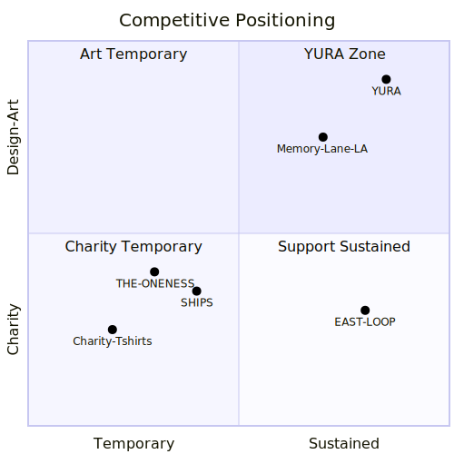

<!-- _class: title -->

# YURA

## 記憶の揺らぎを、力に変える。

### ブランド深掘り調査レポート | 2026.03.10

---

# 本日のアジェンダ

| # | テーマ | 概要 |
|---|--------|------|
| 1 | 調査の目的と背景 | YURA確定後の5軸再調査 |
| 2 | 軸1: 福島アパレル・三恵クレア | 製造パートナーの可能性 |
| 3 | 軸2: 記憶×ファッション | 先行事例と空白領域 |
| 4 | 軸3: 景観プリント技術 | プリント技術・市場・価格 |
| 5 | 軸4: D2Cビジネスモデル | 収益モデルと立ち上げ戦略 |
| 6 | 軸5: 競合・商標分析 | ポジショニングと商標リスク |
| 7 | 総合分析 | SWOT・核心的発見 |
| 8 | ネクストアクション | 優先施策一覧 |

---

# 調査の背景

**前回** — 「被災地×デジタルアーカイブ×アパレル」の全体像を把握
**今回** — ブランドコンセプト確定を受け、**5軸で的を絞った再調査**

> **YURAブランド概要**
> コンセプト：「記憶の揺らぎを、力に変える。」
> 由来：古語「由良」＝ 揺らぎ
> デザイン：被災地の景観プリントTシャツ
> 参考：福島・三恵クレアのサンプルコート

---

<!-- _class: divider -->

# 軸1
## 福島アパレル・三恵クレア

---

# 三恵クレア — 会社プロファイル

| 項目 | 詳細 |
|------|------|
| **所在地** | 福島県南相馬市 |
| **主力製品** | 重衣料（ジャケット、コート、アンサンブル） |
| **実績** | **50年近い**レディース量産経験 |
| **強み** | 難素材のエキスパート / **1〜10枚の少量ロット対応** |
| **取引先** | Paul Smith / Tomorrowland / SHIPS / DES PRES 等 |

---

# YURAとの適合性 & 福島の産業動向

<!-- _class: cols -->

### 適合性評価

| 評価軸 | 判定 |
|--------|------|
| 少量ロット対応 | **適合** |
| 高品質縫製 | **適合** |
| Tシャツ/カットソー | **要確認** |
| コスト感 | **要ヒアリング** |

### 福島県繊維産業の動き

- OEM → **ODM転換中**
- 県が「福島ブランド化」を推進
- 横の連携構築を目指す

### EAST LOOPの成功
- 商品代金の**50%を生産者還元**
- 累計**3,500万円超**
- 支援→自立→**地域ビジネス化**

---

<!-- _class: divider -->

# 軸2
## 記憶×ファッション先行事例

---

# 海外の主要事例

| ブランド | 拠点 | コンセプト | YURAとの関係 |
|---------|------|-----------|-------------|
| **Memory Lane LA** | ロサンゼルス | 経験のストーリーをアパレルで伝え、未来への動きを作る | **最も近い**コンセプト |
| **9/11 Memorial Store** | ニューヨーク | メモリアル施設に紐づいたアパレル | 「場所×ファッション」モデル |
| **Beautiful Disaster** | 米国 | 困難を力に変える女性を称える | 「揺らぎを力に」と共通 |

### 重要なポイント
- Memory Lane LAは**災害特化ではない** → YURAの差別化余地
- 9/11モデルは**施設との紐づけ**が強み → 被災地メモリアルとの連携可能性

---

<!-- _class: keyfinding -->

# 最大の発見：ブルーオーシャン

> **「風化防止」を明確なミッションに据えた
> ファッションブランドは、世界的に発見できなかった。**

### 既存の震災×ファッションの実態

| 特徴 | 実態 |
|------|------|
| 期間 | 災害直後〜**1年**で終了 |
| デザイン | 「がんばろう○○」型メッセージ重視 |
| ブランド性 | **低い**（イベントグッズの域） |
| 継続性 | ほぼ**皆無** |

### → YURAは「風化防止ファッション」という**新カテゴリを創出できる**

---

<!-- _class: divider -->

# 軸3
## 景観プリント・フォトプリント技術

---

# プリント技術 4方式の比較

| 技術 | 品質 | コスト | 最小ロット | 適用素材 | 写真表現 |
|------|------|--------|-----------|---------|---------|
| **DTG** | 高 | 初期低・単価高 | 1枚〜 | 綿向き | ◎ |
| **昇華転写** | 非常に高 | 中程度 | 1枚〜 | ポリエステル限定 | ◎ |
| **シルクスクリーン** | 高 | 版代あり・大量安 | 15枚〜 | 幅広い | △ |
| **DTF** | 高 | 中程度 | 1枚〜 | 幅広い | ○ |

### YURAへの推奨
- **初期テスト** → DTG or DTF（1枚から / リスク最小）
- **白T×風景の量産** → **昇華転写**（色落ちしにくい / 写真表現に最適）

---

# 市場規模 & 推奨価格帯

<!-- _class: cols -->

### カスタムTシャツ市場

| 指標 | 数値 |
|------|------|
| グローバル（2024） | **54.2億ドル** |
| グローバル（2031予測） | 120.6億ドル |
| **CAGR** | **12.1%** |
| 日本国内（現在） | 500億円 |
| 日本国内（将来） | **1,200億円** |

### YURAの価格ポジション

| 帯域 | 価格 | 例 |
|------|------|----|
| チャリティーT | 2,000〜3,000円 | SHIPS等 |
| **→ YURA** | **5,000〜8,000円** | **独自** |
| デザイナーズT | 8,000〜20,000円 | コラボ品 |

品質×ストーリーで価格を正当化。
チャリティーTとの差別化に**やや上の帯域**が最適。

---

<!-- _class: divider -->

# 軸4
## ソーシャルインパクトD2Cモデル

---

# TOMSの教訓 — 1:1モデルの栄光と挫折

> **教訓：善意だけではビジネスは続かない。持続可能な設計が必須。**

---

# Bombas vs TOMS — 寄付モデルの明暗

| 項目 | TOMS（旧） | TOMS（現） | Bombas |
|------|-----------|-----------|--------|
| モデル | 1足→1足寄付 | **利益の1/3**寄付 | 1購入→1寄付 |
| 結果 | **経営難**（2019） | 持続可能に転換 | **累計1億点超**寄付 |
| 成功要因 | — | モデル転換 | **効率的生産**で両立 |

### 日本の参考事例

| ブランド | 概要 | 寄付形態 |
|---------|------|---------|
| EAST LOOP | 被災地ニット | 商品代金の**50%** |
| SHIPS ONE SHIPS | チャリティーT ¥3,000 | **全額**（経費除く） |

---

# 日本のD2C成功モデル — ALL YOURS

- クラウドファンディング発の機能性D2Cブランド
- **CAMPFIRE AWARD 2017** ファッション部門賞
- CF支援金額 ファッションカテゴリ**No.1**

### クラウドファンディング成功の4要素

| 要素 | 施策例 |
|------|--------|
| **限定性** | 支援者限定カラー・ネームタグ |
| **参加感** | 商品企画・ポップアップへの参加権 |
| **ストーリー** | 「なぜ作るのか」の明確な物語 |
| **信頼性** | 実物サンプルの提示 |

---

# YURAの推奨ビジネスモデル

### 寄付設計
- **売上の10〜15%** を復興支援に充当（利益の約1/3相当）
- **透明性**が最重要：寄付先・使途をWebで可視化
- QRコードで被災地のストーリーにアクセス

### 立ち上げロードマップ

---

<!-- _class: divider -->

# 軸5
## 競合・商標分析

---

# 競合ポジショニングマップ

**結論：YURAの「風化防止×アート×継続ブランド」ポジションは空白。直接競合は存在しない。**

---

# 商標リスク分析

| 既存名称 | 分野 | 区分 | 競合リスク |
|---------|------|------|-----------|
| NIWAKA「由良 YURA」 | ジュエリー | 第14類 | **低** |
| 由良産商 | 商社 | — | **低〜中** |
| Yura（SATELLITE） | インテリア | — | **低** |

### 対応方針
- アパレル区分（**第25類：被服**）での競合は**確認されず**
- **J-PlatPatでの正式調査が必須**
- 「Yur-A」表記はより独自性が高い
- **早期の商標出願を強く推奨**

---

<!-- _class: divider -->

# 総合分析
## YURAの戦略的ポジション

---

# SWOT分析

<!-- _class: cols -->

### 強み（S）& 機会（O）

| | 内容 |
|---|---|
| **S1** | カテゴリ創出の機会 |
| **S2** | 直接競合の不在 |
| **S3** | 三恵クレアの技術力 |
| **O1** | カスタムT市場 CAGR 12.1% |
| **O2** | 福島県のブランド化推進策 |
| **O3** | D2C×CFの成功モデル確立済み |

### 弱み（W）& 脅威（T）

| | 内容 |
|---|---|
| **W1** | 新規ブランドの認知ゼロ |
| **W2** | 市場教育コスト |
| **W3** | 初期資金・リソース制約 |
| **T1** | チャリティーTと同一視リスク |
| **T2** | 一過性で終わるリスク |
| **T3** | 商標リスク（NIWAKA由良） |

---

<!-- _class: keyfinding -->

# 3つの核心的発見

### 1. ブルーオーシャン
「風化防止ファッション」ブランドは**世界的に不在**。
YURAが先行者になれる。

### 2. チャリティーTとの差別化が生命線
一過性・メッセージ型との違いを**デザイン性・継続性・哲学性**で明確に。

### 3. 持続可能な寄付モデルの設計
TOMSの教訓を活かし、**売上10〜15%寄付**で事業の持続性を確保。

---

<!-- _class: divider -->

# ネクストアクション

---

# 優先施策ロードマップ

### 即座に着手（優先度：高）

| # | アクション | 担当 |
|---|-----------|------|
| 1 | **商標出願**（YURA / Yur-A 第25類） | 法務 |
| 2 | **三恵クレアへのコンタクト**（Tシャツ対応可否） | アパレル部門 |
| 3 | **プリント技術のサンプル発注**（DTG / 昇華転写） | クリエイティブ |

### 短期（1〜3ヶ月）

| # | アクション | 担当 |
|---|-----------|------|
| 4 | Makuakeプロジェクト設計 | マーケティング |
| 5 | 写真家パートナーシップ構築 | クリエイティブ |
| 6 | 寄付モデルの確定・寄付先選定 | CEO / 財務 |

---

<!-- _class: title -->

# YURA

## 記憶の揺らぎを、力に変える。

### 風化防止ファッションという新カテゴリを、世界に先駆けて創出する。

---
